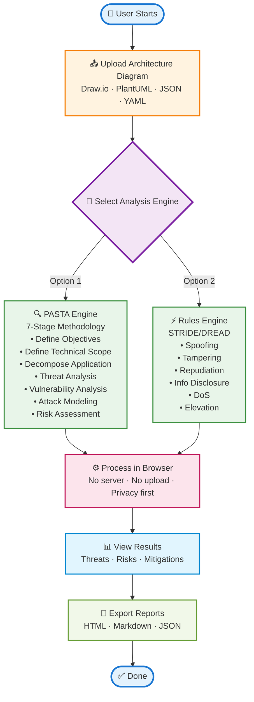
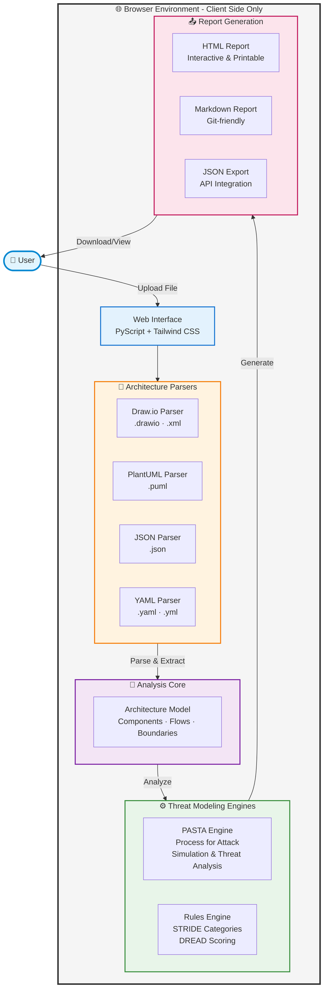

# Threat Model Automator

Automated threat modeling tool that analyzes architecture diagrams using PASTA and STRIDE/DREAD methodologies directly in your browser.

## What is this?

Threat Model Automator converts architecture diagrams (Draw.io, PlantUML, JSON, YAML) into comprehensive threat models with automated risk assessment. All processing happens in your browser using PyScript - no backend required, ensuring your architecture data never leaves your device.

## How it works

### User Workflow


### Technical Architecture


## Installation (Local Use)

### Prerequisites
- Python 3.11+
- pip

### Setup

```bash
# Clone the repository
git clone https://github.com/realnits/shellthreatmodel.git
cd shellthreatmodel

# Create virtual environment
python -m venv .venv
source .venv/bin/activate  # On Windows: .venv\Scripts\activate

# Install package
pip install -e .
```

### CLI Usage

```bash
# PASTA methodology
shellthreatmodel analyze architecture.puml --mode pasta --output-dir reports/

# STRIDE/DREAD rules-based
shellthreatmodel analyze diagram.drawio --mode rules --output-dir reports/

# Start local API server
shellthreatmodel serve --host 127.0.0.1 --port 9000
```

### Browser UI (Local)

```bash
# Serve the web UI locally
cd web
python -m http.server 8080

# Visit http://localhost:8080
```

## Roadmap

### Completed ✅
- [x] Browser-based threat modeling (PyScript)
- [x] Multi-format parsing (Draw.io, PlantUML, JSON, YAML)
- [x] PASTA 7-stage methodology
- [x] Rules-based STRIDE/DREAD engine
- [x] HTML/Markdown/JSON report generation
- [x] GitHub Pages deployment
- [x] CLI tool

### In Progress 🚧
- [ ] Enhanced visualization (interactive threat graphs)
- [ ] Threat categorization improvements
- [ ] Custom rule definitions
- [ ] Report export enhancements (PDF)

### Planned 🎯
- [ ] AI-powered threat detection (optional LLM integration)
- [ ] Attack tree generation
- [ ] Mitigation tracking system
- [ ] Multi-language support
- [ ] VS Code extension
- [ ] CI/CD integration templates
- [ ] Threat library management
- [ ] Comparative analysis between diagrams
- [ ] SBOM integration for supply chain threats
- [ ] Compliance mapping (NIST, ISO 27001, etc.)

---

**Live Demo:** https://realnits.github.io/shellthreatmodel/

**License:** MIT
